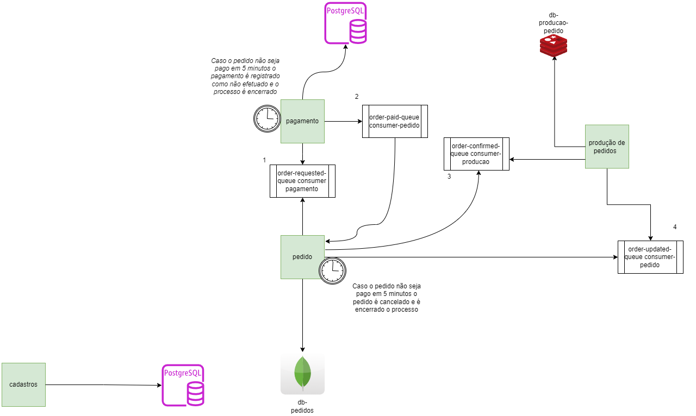
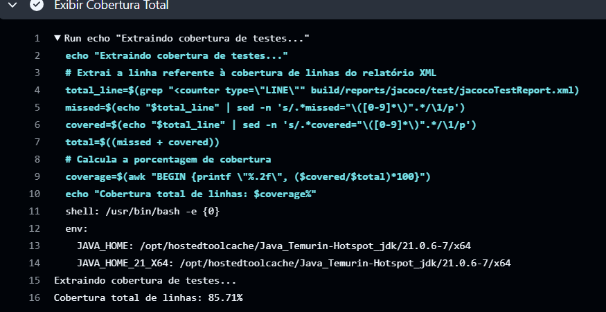

# techchallenge-pedido

## 1- Objetivo
A aplicação foi desenvolvida utilizando Spring Boot, Java 11, Maven, Junit, Mockito, H2 Database, Swagger, Docker, Docker Compose, Jenkins, SonarQube, Jacoco, Git, Github, Postman, IntelliJ IDEA, Visual Studio Code, Windows 10, Linux Ubuntu 20.04.
tem como objetivo simular um microsserviço de pedidos de uma loja virtual.

## 2- Funcionalidades
As funcionalidades implementadas são:
 - Cadastrar um pedido
 - Listar todos os pedidos
 - Listar um pedido por id
 - Acompanhar o status do pedido
 - Cancelar um pedido
 - atualizar o status do pedido

## 3 - Integrações
Integração com os serviçco de Pagamento e Produção de Pedidos, integração feita via mensaferia utilizando RabbitMQ.

## 4- Endpoint
### Acesso ao Swagger

Para acessar a documentação **Swagger** da API, use o seguinte endereço:

```
http://localhost:8080/swagger-ui.html
```
## 5 - Dados
é um utilizado o banco de dados Mongo, e abaixo segue um exemplo de pedido que pode ser cadastrado.-*/+ -/

### Pedido
```json
{
   "_id": {
      "$oid": "67ae65e39bba52298a2a9949"
   },
   "orderNumber": 11,
   "orderDate": {
      "$date": "2025-02-13T21:36:35.382Z"
   },
   "totalValue": "75.36",
   "orderStatus": "FINISHED",
   "items": [
      {
         "quantity": 2,
         "unitPrice": "25.12",
         "product": {
            "name": "Produto A",
            "description": "PRD",
            "price": "25.12",
            "productCategory": "SNACK"
         },
         "totalPrice": "50.24"
      },
      {
         "quantity": 1,
         "unitPrice": "25.12",
         "product": {
            "name": "Produto B",
            "description": "PRD",
            "price": "25.12",
            "productCategory": "SNACK"
         },
         "totalPrice": "25.12"
      }
   ],
   "paymentStatus": "CANCELED",
   "customer": {
      "name": "Wilson",
      "document": "12345678901"
   }
}
```

## 6 - Desenho de Solução


## 7 - Como executar o projeto localmente
### Pré-requisitos
- **Docker**

### Passos
1. Clone o repositório:
    ```bash
    git clone https://github.com/rinaldomedeiros/techchallenge-pedido
    cd techchallenge-pedido
    ```
2. Suba o ambiente
3.  ```bash
    docker-compose up
    ```
4. Acesse o Swagger
    

## 8 - Evidencia do Teste Unitário Executado e sua Cobertura 

